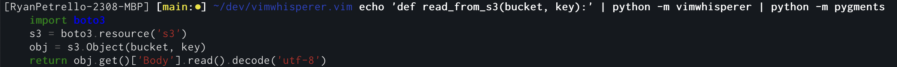

# Vimwhisper

A simple Vim plugin for AWS CodeWhisperer code completion support.

## Configuration and Authentication

If necessary, set the following environment variables:

```
    ~ export VIM_AWS_SSO_START_URL='https://my-example-app.awsapps.com/start'
    ~ export VIM_AWS_SSO_REGION='us-west-2'
```

Authenticate for the first time using AWS IAM Identity Center.

An OIDC client and Bearer token will be generated, and will be cached at ``~/.vim/.aws-code-whisperer-auth`` for subsequent API calls:

```
    ~ python -m vimwhisperer.login
```

## Running Code Completion by Hand


